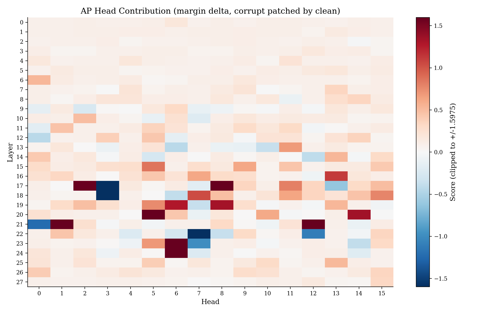
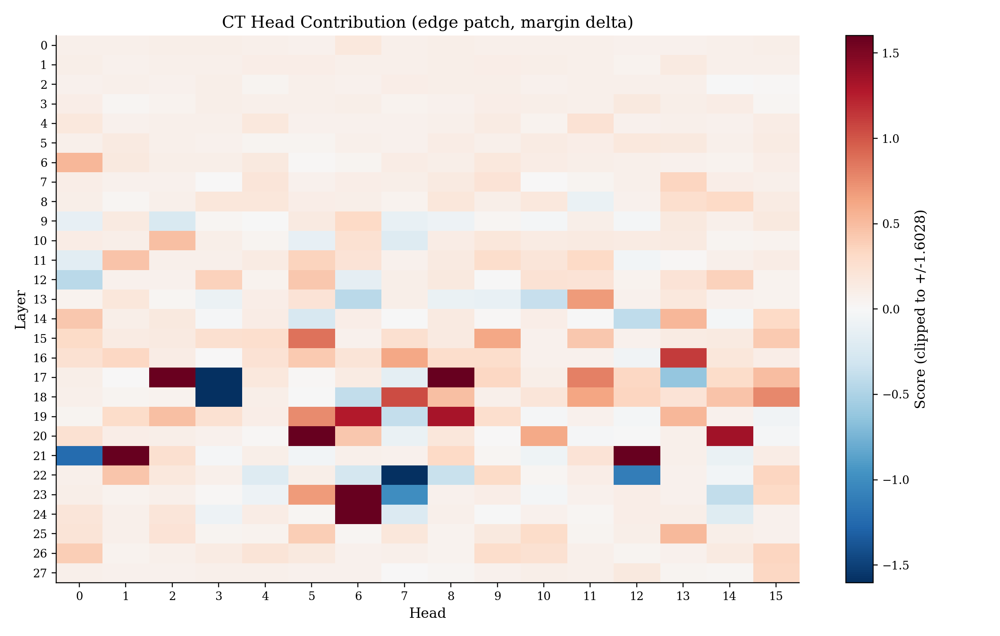
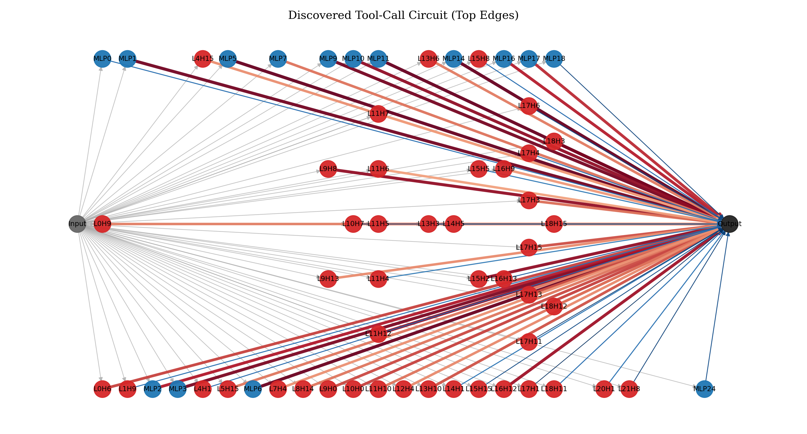
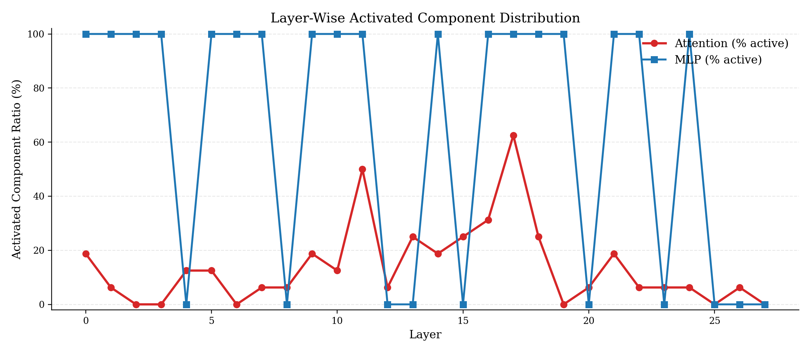
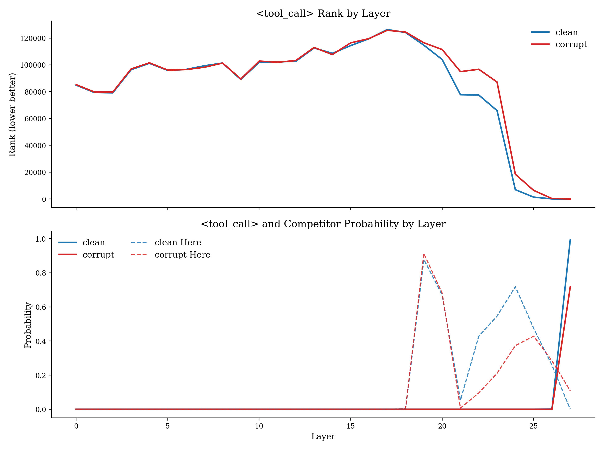
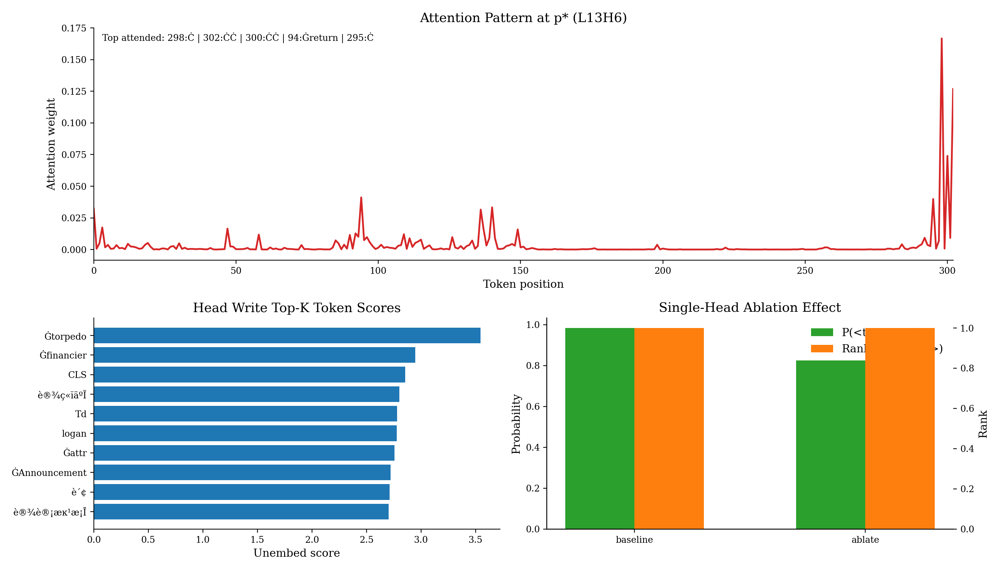

# Tool-Call Circuit Discovery Final Report

本目录是本次任务的最终交付包，只看这里即可复现核心结论与阅读主要结果。

## 1. 任务目标与范围

目标：解释 Qwen3-1.7B 在下一 token 位置为何会选择 `<tool_call>`（或不选择）。

本实验严格聚焦于：
- 电路定位/发现（AP、CT、DeltaS、剪枝子图）
- 因果行为验证（单头 ablation + probe）
- 结构性结论（layer distribution、rank/prob、completeness）

未做内容：知识编辑（ROME/FT-M）与应用向实验。

## 2. 实验设置

- 模型：`/root/data/Qwen/Qwen3-1.7B`
- 数据：`/root/data/R3/pair`（批量）+ `/root/data/R4/sample`（running example）
- 硬件：RTX 4090 24GB
- 精度：`float16`
- 随机种子：`42`

最终主结果对应配置：
- `analysis_max_pairs=32`（用于发现电路，记作 `D_val`）
- `completeness_test_max_pairs=48`（留出评估，记作 `D_test`）
- `tau_grid={0.02, 0.01, 0.005}`
- `max_circuit_edges=80`
- `random_trials=50`
- `non_circuit_retain=0.7`

## 3. 核心结论（先看这个）

### 3.1 基线（Full model）

在全 164 对样本上复算得到：
- `ToolCall@1_clean = 0.8841`
- `Reject@1_corr = 0.8293`
- `Balanced = 0.7134`

见：`reports/baseline_first_token.csv`。

### 3.2 最佳电路（主结论）

最佳阈值：`tau=0.005`，电路规模：`80` edges（`62` heads + `18` MLP，`edge_ratio=0.1681`）。

在 `D_test`（48 对留出样本）上：

| Setting | ToolCall@1_clean | Reject@1_corr | Balanced |
|---|---:|---:|---:|
| Full model | 1.0000 | 1.0000 | 1.0000 |
| Circuit-only | 0.7500 | 0.5000 | 0.2500 |
| Random same-size | 0.5508 | 0.2458 | 0.0138 |

关键差值：
- `Delta Balanced (Circuit - Random) = +0.2363`
- `objective_gap_vs_random = +0.3269`
- `p_balanced_vs_random = 0.0196`
- `p_objective_vs_random = 0.0196`

解释：同等规模随机子图几乎不能保持行为，而发现电路可以稳定恢复显著更高的目标行为，且统计显著。

## 4. 图表与机制解释

### 4.1 AP 热力图（节点级贡献）



- 含义：在 corrupt 前向中，将单头在 `p*` 的激活替换为 clean，对 `<tool_call>` margin 的提升。
- 图使用红蓝发散色图（0 居中）；颜色条显示做了分位裁剪（提升可读性）。

### 4.2 CT 热力图（边/路径级贡献）



- 含义：仅恢复特定边贡献时，对 `<tool_call>` margin 的提升。
- 与 AP 高值区域整体一致，支持关键组件的因果一致性。

### 4.3 最终发现电路图



- 节点：Input / Attention heads / MLP / Output。
- 边权主要由 `DeltaS = S_clean - S_corr` 导出并筛选。
- 可视化展示了从输入到输出的关键中介子图。

### 4.4 层分布（论文风格）



- 纵轴是各层被激活组件比例（attention 与 MLP 分开）。
- 该图用于回答“信息在网络深度上的组织方式”，对齐论文的 layer distribution 叙述。

### 4.5 层间 rank/prob 轨迹（含竞争 token）



- 上图：`<tool_call>` rank 随层变化（越低越好）。
- 下图：`<tool_call>` 概率与主要竞争 token 概率轨迹（clean/corrupt 对照）。
- 体现“中后层概率抬升”的行为模式。

### 4.6 关键头 probe：`L13H6`



包含三部分：
- 注意力模式（关注哪些 token）
- 头输出写入词表后的 top-K token 分数
- 单头 ablation 前后 `<tool_call>` 的概率/排名变化

核心数值：
- `P_base(<tool_call>) = 0.9837`
- `P_ablate(<tool_call>) = 0.8245`
- `prob_drop = 0.1593`

说明该头对最终 `<tool_call>` 选择有强因果影响。

## 5. 显著性与稳健性

### 5.1 论文风格 completeness 汇总

见：`reports/completeness_table_like_paper.csv`

| tau | #Edge | D_val Original(G) | D_val Circuit(C) | D_test Original(G) | D_test Random | D_test Circuit(C) | D_test ΔBalanced | p(D_test) |
|---:|---:|---:|---:|---:|---:|---:|---:|---:|
| 0.02  | 80 | 1.0000 | 0.2813 | 1.0000 | 0.0183 | 0.2500 | 0.2317 | 0.0196 |
| 0.01  | 80 | 1.0000 | 0.2813 | 1.0000 | 0.0192 | 0.2500 | 0.2308 | 0.0196 |
| 0.005 | 80 | 1.0000 | 0.2813 | 1.0000 | 0.0138 | 0.2500 | 0.2363 | 0.0196 |

结论：三个 tau 下都稳定显著，`tau=0.005` 略优。

### 5.2 电路规模稳健性（edges sweep）

见：`reports/robustness_edge_sweep.csv`

| max_edges | D_test Circuit Balanced | D_test Random Balanced | Delta | p |
|---:|---:|---:|---:|---:|
| 40  | 0.2083 | 0.0052 | +0.2031 | 0.0476 |
| 60  | 0.1250 | 0.0115 | +0.1135 | 0.0476 |
| 80  | 0.2500 | 0.0135 | +0.2365 | 0.0476 |
| 120 | 0.0000 | 0.0375 | -0.0375 | 1.0000 |

结论：
- 过小（40/60）恢复能力下降；
- 过大（120）明显退化，出现噪声淹没；
- `80` 是更合理的复杂度-性能折中点。

## 6. 目录说明（你只需看这里）

- `figs/`：核心图（AP/CT、电路图、层分布、rank/prob、关键头 probe）
- `reports/`：核心表格与日志（基线、电路边、completeness、稳健性）
- `src/run_toolcall_circuit.py`：本次最终实验脚本快照

## 7. 最小复现命令

```bash
python src/run_toolcall_circuit.py \
  --analysis-max-pairs 32 \
  --completeness-test-max-pairs 48 \
  --tau-grid 0.02 0.01 0.005 \
  --max-circuit-edges 80 \
  --random-trials 50 \
  --non-circuit-retain 0.7
```

---

如果你后续只想看一个文件，优先看本 `README.md`；如果只看一个结果表，优先看 `reports/completeness_table_like_paper.csv`。
